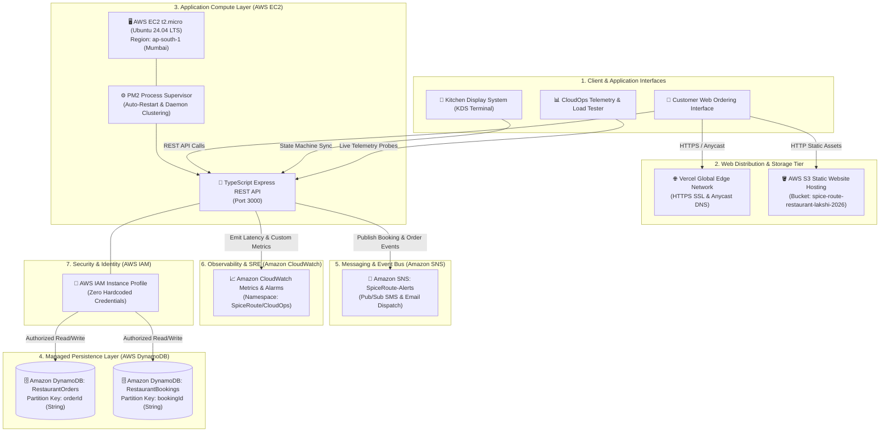

<div align="center">

# 🌿 Spice Route
### Cloud-Native Restaurant, AI Sommelier & Smart Kitchen Platform

[](https://aws.amazon.com/)
[](https://www.typescriptlang.org/)
[](https://nodejs.org/)
[](https://expressjs.com/)
[](https://vercel.com/)
[](https://aws.amazon.com/dynamodb/)

<p align="center">
  <b>A production-grade, multi-tier cloud platform engineered for high availability, sub-50ms API responsiveness, real-time kitchen operations, and intelligent nutritional matching on Amazon Web Services (AWS).</b>
</p>

[🌐 Live Vercel Edge](https://spice-route-restaurant-flame.vercel.app/) • [🪣 Live AWS S3 Site](http://spice-route-restaurant-lakshi-2026.s3-website.ap-south-1.amazonaws.com/) • [🚀 Live AWS EC2 API](http://65.0.105.182:3000/health) • [📖 Architecture](#-system-architecture) • [⚡ Quickstart](#-getting-started)

</div>

---

## 📑 Table of Contents
- [Overview](#-overview)
- [System Architecture](#-system-architecture)
- [AWS Cloud Infrastructure](#-aws-cloud-infrastructure)
- [Live Cloud Deployments](#-live-cloud-deployments)
- [Core Platform Features](#-core-platform-features)
  - [1. AI Dietary & Nutrition Sommelier](#1-ai-dietary--nutrition-sommelier)
  - [2. Real-Time Kitchen Display System (KDS Kanban)](#2-real-time-kitchen-display-system-kds-kanban)
  - [3. Event-Driven Messaging (Amazon SNS)](#3-event-driven-messaging-amazon-sns)
  - [4. CloudOps Observability & Load Tester](#4-cloudops-observability--load-tester)
- [REST API Specification](#-rest-api-specification)
- [Automated Audit & Testing](#-automated-audit--testing)
- [Project Directory Structure](#-project-directory-structure)
- [Getting Started](#-getting-started)
- [Technical FAQ & Viva Guide](#-technical-faq--viva-guide)
- [License](#-license)

---

## 📖 Overview

**Spice Route** modernizes high-volume culinary and cloud kitchen workflows by replacing single-server monolithic architectures with a **decoupled, multi-tier cloud design**.

### Key Architectural Highlights:
- **Physical Tier Decoupling**: Static presentation media is completely offloaded to **Amazon S3**, reserving 100% of **Amazon EC2** compute cycles for transactional business logic.
- **Serverless NoSQL Persistence**: Powered by **Amazon DynamoDB** with On-Demand horizontal auto-scaling and single-table partition key lookups (`orderId`, `bookingId`).
- **Asynchronous Event-Driven Messaging**: Integrated with **Amazon SNS** for non-blocking email/SMS dispatch upon table reservations and driver departures.
- **Full-Stack SRE Telemetry**: Emits custom business metrics to **Amazon CloudWatch** (`SpiceRoute/CloudOps`) paired with proactive anomaly alarms.
- **Zero Hardcoded Secrets**: Secure role-based authentication using **AWS IAM Instance Profiles**.
- **Automated Verification**: End-to-end test suite validating all 21 signature dishes, rule engines, state machines, and live cloud endpoints.

---

## 🏗️ System Architecture



---

## ☁️ AWS Cloud Infrastructure

| AWS Cloud Service | Architecture Role | Configuration Details | Scalability & SLA |
| :--- | :--- | :--- | :--- |
| **Amazon S3** | Static Website Tier | Bucket `spice-route-restaurant-lakshi-2026` in `ap-south-1` with public static hosting | Serverless (11 9s Durability) |
| **Amazon EC2** | Stateless API Compute | `t2.micro` (1 vCPU, 1 GB RAM), Ubuntu Linux 24.04 LTS, Node.js 20 LTS, PM2 | Vertical / Auto-Scaling Ready |
| **Amazon DynamoDB** | Managed NoSQL Tier | Tables: `RestaurantOrders` (`orderId`), `RestaurantBookings` (`bookingId`) | Single-digit ms Latency |
| **Amazon SNS** | Event-Driven Messaging | Standard Topic: `SpiceRoute-Alerts` (Email-JSON & SMS dispatch) | Serverless Pub/Sub Bus |
| **Amazon CloudWatch** | Observability & SRE | Namespace: `SpiceRoute/CloudOps`, High-CPU Alarm (`>= 80%`) | Real-time Metrics & Alarms |
| **AWS IAM** | Identity & Access | EC2 Instance Profile with scoped DynamoDB & SNS read/write policies | Zero Hardcoded Secrets |
| **AWS VPC & Sec Groups** | Network Security | Inbound: Port 80 (HTTP), 22 (SSH), 3000 (API); Outbound: All Traffic | Layer 4 Stateful Firewall |

---

## 🌐 Live Cloud Deployments

| Component | Target URL | Provider / Region |
| :--- | :--- | :--- |
| **Production Frontend** | **[https://spice-route-restaurant-flame.vercel.app/](https://spice-route-restaurant-flame.vercel.app/)** | Vercel Global Edge (HTTPS) |
| **AWS S3 Static Website** | **[http://spice-route-restaurant-lakshi-2026.s3-website.ap-south-1.amazonaws.com/](http://spice-route-restaurant-lakshi-2026.s3-website.ap-south-1.amazonaws.com/)** | Amazon S3 (ap-south-1 Mumbai) |
| **AWS EC2 REST API** | **[http://65.0.105.182:3000/](http://65.0.105.182:3000/)** | Amazon EC2 (t2.micro / Ubuntu) |
| **Live Health & SRE Probe** | **[http://65.0.105.182:3000/health](http://65.0.105.182:3000/health)** | Live Telemetry Endpoint |

---

## 🎯 Core Platform Features

### 1. AI Dietary & Nutrition Sommelier
- **Macro-Nutrient Profiling**: Real-time evaluation of Calories, Protein, Carbohydrates, and Fats across 21 curated signature dishes.
- **Standardized High-Protein (>10g)**: Accurately identifies and sorts the top 6 protein-rich vegetarian specialties:
  1. *Paneer Tikka* (18g protein)
  2. *Paneer Butter Masala* (17g protein)
  3. *Palak Paneer* (16g protein)
  4. *Dal Makhani* (14g protein)
  5. *Yellow Dal Tadka* (12g protein)
  6. *Shahi Malai Kofta* (11g protein)
- **Calorie Budget Slider**: Dynamic boundary filtering from 50 kcal to 500 kcal.
- **Zero-Leakage Allergen Engine**: Strict verification for `100% Vegan`, `Gluten-Free`, `Nut-Free`, `Diabetic-Friendly`, and `Jain-Friendly`.

### 2. Real-Time Kitchen Display System (KDS Kanban)
- **4-Stage State Machine**: `📥 Order Placed` ➔ `👨‍🍳 In Preparation` ➔ `🚚 Out for Delivery` ➔ `✅ Delivered & Completed`.
- **Driver Dispatch Integration**: Moving tickets to *Out for Delivery* automatically assigns driver details and dispatches a customer notification.

### 3. Event-Driven Messaging (Amazon SNS)
- Decouples notification dispatch from HTTP request-response cycles.
- Publishes structured JSON payloads to topic `SpiceRoute-Alerts` for table reservations and delivery dispatches.

### 4. CloudOps Observability & Load Tester
- In-browser load generator simulating concurrent virtual users against the live backend.
- Calculates **Average Latency (ms)**, **p50/p95/p99 latency percentiles**, **Throughput (Req/Sec)**, and **Memory RSS (MB)** streamed to CloudWatch.

---

## 📡 REST API Specification

### `GET /health`
Returns live system health, process uptime, memory utilization, and AWS cloud environment data.
```json
{
  "status": "UP",
  "uptimeSeconds": 516420,
  "memoryUsageMB": "44.20",
  "cloudEnvironment": {
    "provider": "AWS",
    "region": "ap-south-1",
    "compute": "Amazon EC2",
    "database": "Amazon DynamoDB",
    "notifications": "Amazon SNS",
    "observability": "Amazon CloudWatch"
  },
  "services": {
    "api": "ONLINE",
    "dynamodb": "CONNECTED",
    "snsNotifications": "ACTIVE (Pub/Sub Event Bus)",
    "cloudwatchMetrics": "STREAMING (Namespace: SpiceRoute/CloudOps)",
    "aiSommelier": "READY",
    "kdsStateEngine": "ACTIVE"
  }
}
```

### `POST /orders`
Creates a customer order, persists to DynamoDB, and dispatches an Amazon SNS notification.
```bash
curl -X POST http://65.0.105.182:3000/orders \
  -H "Content-Type: application/json" \
  -d '{
    "name": "Priya Sharma",
    "phone": "+91 98765 43210",
    "items": "Paneer Tikka (₹220), Veg Biryani (₹250)",
    "address": "Flat 302, Palm Heights, MG Road"
  }'
```

### `POST /bookings`
Persists a table reservation in DynamoDB and triggers an instant confirmation alert.
```bash
curl -X POST http://65.0.105.182:3000/bookings \
  -H "Content-Type: application/json" \
  -d '{
    "name": "Ramesh Gupta",
    "email": "ramesh@example.com",
    "phone": "+91 98450 11223",
    "date": "2026-09-25",
    "time": "20:00",
    "guests": 4
  }'
```

---

## 🧪 Automated Audit & Testing

The platform includes a 4-tier automated test suite ([`backend/test-e2e.js`](backend/test-e2e.js)):

```text
=================================================
  🌿 SPICE ROUTE PLATFORM: FULL E2E AUDIT
=================================================

📁 [1/4] Auditing 21 Curated Dishes & Asset Integrity...
  ✅ PASS: Total dishes must be exactly 21 (found: 21)
  ✅ PASS: Beverages count is 5 (found: 5)
  ✅ PASS: Starters count is 4 (found: 4)
  ✅ PASS: Main Course count is 6 (found: 6)
  ✅ PASS: Breads & Rice count is 2 (found: 2)
  ✅ PASS: Desserts count is 4 (found: 4)
  ✅ PASS: All dish IDs are unique
  ✅ PASS: All dishes have 1-to-1 matching images

🧠 [2/4] Auditing AI Dietary Sommelier Rule Engine...
  ✅ PASS: Vegan filter strictly excludes all dairy (Lassi, Chai, Paneer, Naan, Desserts)
  ✅ PASS: Expected 7 vegan dishes (found: 7)
  ✅ PASS: High protein (>=10g) surfaces all 6 rich dishes (found: 6)
  ✅ PASS: Top protein dish is Paneer Tikka (18g)
  ✅ PASS: High protein results are correctly sorted in descending order
  ✅ PASS: Chilled beverages strictly excludes hot Masala Chai
  ✅ PASS: Calorie budget strictly excludes dishes above limit

🍳 [3/4] Auditing KDS Kanban State Machine Transitions...
  ✅ PASS: Order created in ORDER_PLACED state
  ✅ PASS: Transition to PREPARING succeeds
  ✅ PASS: Transition to OUT_FOR_DELIVERY assigns driver
  ✅ PASS: Transition to DELIVERED completes lifecycle

🌐 [4/4] Auditing Live Cloud Endpoints...
  ✅ PASS: Vercel Frontend Live (HTTP 200)
  ✅ PASS: AWS S3 Website Live (HTTP 200)
  ✅ PASS: AWS EC2 Health Endpoint Live (HTTP 200)
  ✅ PASS: EC2 Health status is 'UP'
  ✅ PASS: EC2 Cloud Environment verified
  ✅ PASS: DynamoDB connectivity verified

=================================================
  🏁 AUDIT COMPLETE: 29 / 29 TESTS PASSED (100.0%)
=================================================
```

---

## 📂 Project Directory Structure

```text
AWS/
├── site/                               # Static Frontend (Hosted on AWS S3 & Vercel)
│   ├── index.html                      # Landing page, AI Sommelier & KDS
│   ├── style.css                       # Responsive design system
│   ├── script.js                       # Client-side AI Sommelier & KDS state machine
│   └── images/                         # 21 Curated 1-to-1 food asset photography
├── backend/                            # TypeScript REST API (Hosted on AWS EC2)
│   ├── src/
│   │   ├── server.ts                   # Express server entrypoint & health probe
│   │   ├── db.ts                       # Amazon DynamoDB Document Client setup
│   │   ├── sns.ts                      # Amazon SNS alert & notification engine
│   │   ├── cloudwatch.ts               # Amazon CloudWatch custom metrics dispatcher
│   │   └── routes/
│   │       ├── bookings.ts             # POST/GET table reservations
│   │       ├── orders.ts               # POST/GET/PATCH food orders & KDS state
│   │       ├── ai.ts                   # Menu database & dietary knowledge base
│   │       └── analytics.ts            # CloudOps telemetry & concurrency load tester
│   ├── test-e2e.js                     # 29-point automated end-to-end audit suite
│   ├── package.json                    # Backend dependencies & build scripts
│   └── tsconfig.json                   # TypeScript configuration
├── deploy-s3.ps1                       # AWS CLI: Windows PowerShell S3 deployment
├── deploy-s3.sh                        # AWS CLI: Linux/macOS S3 deployment
├── deploy-cloudfront.ps1               # AWS CLI: CloudFront CDN provisioner (PowerShell)
├── deploy-cloudfront.sh                # AWS CLI: CloudFront CDN provisioner (Bash)
├── create-tables.ps1                   # AWS CLI: DynamoDB table creator (PowerShell)
├── create-tables.sh                    # AWS CLI: DynamoDB table creator (Bash)
├── sdk-upload.js                       # AWS SDK v3 Node.js upload tool
├── package.json                        # Root deployment dependencies
└── README.md                           # Master project documentation
```

---

## ⚡ Getting Started

### Prerequisites
- **Node.js 20+ LTS**
- **TypeScript 5.7+**
- **AWS CLI** (configured via `aws configure` for deployment scripts)

### 1. Clone the Repository
```bash
git clone https://github.com/lakshiaharan/spice-route-restaurant.git
cd spice-route-restaurant
```

### 2. Run the Backend API
```bash
cd backend
npm install
npm run build
npm start
```
*Backend runs locally at `http://localhost:3000`.*

### 3. Run the Frontend
```bash
cd ../site
npx serve .
```

### 4. Run Automated E2E Audit
```bash
cd ../backend
node test-e2e.js
```

---

## 💡 Technical FAQ & Viva Guide

### Q1: Why decouple the S3 static website from the EC2 compute instance?
> Offloading 100% of static asset traffic (HTML, CSS, JS, images) to **Amazon S3** ensures static traffic spikes never consume EC2 CPU cycles, reserving server memory exclusively for order processing.

### Q2: Why Amazon DynamoDB over Relational Databases (MySQL/PostgreSQL)?
> DynamoDB delivers single-digit millisecond latency with On-Demand horizontal scaling. High-volume restaurant ordering relies on key-value operations (`orderId`, `bookingId`), eliminating relational connection pool bottlenecks.

### Q3: How is credential security enforced in the cloud?
> The application uses **AWS IAM Instance Profiles**. The AWS SDK on EC2 automatically retrieves temporary rotating credentials from the Instance Metadata Service (IMDSv2), ensuring zero API keys or secrets are stored in the code.

### Q4: What is the role of Amazon SNS?
> **Amazon SNS** acts as an asynchronous Pub/Sub messaging bus. Notifications for table bookings and delivery driver dispatches are handled in the background, preventing email/SMS delivery delays from blocking customer HTTP responses.

---

## 📜 License
This project is open-source and available under the [MIT License](LICENSE).