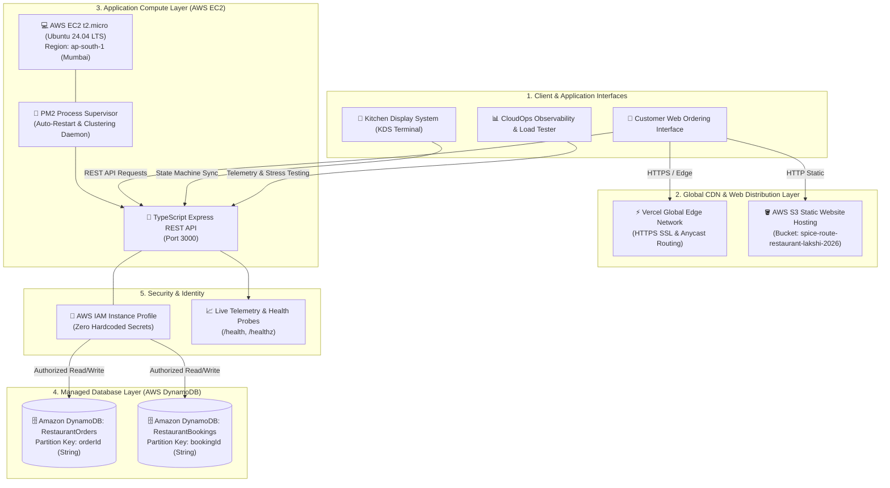

# 🌿 Spice Route — Cloud-Native Restaurant & Smart Kitchen Platform

[](https://aws.amazon.com/)
[](https://aws.amazon.com/free/)
[](https://www.typescriptlang.org/)
[](https://nodejs.org/)
[](https://expressjs.com/)
[](https://vercel.com/)
[](https://aws.amazon.com/dynamodb/)
[](LICENSE)

> A production-ready, cloud-native restaurant management, dietary advisory, and real-time kitchen operations platform engineered for high availability, low latency, and zero-cost cloud efficiency across Amazon Web Services (AWS) and Vercel Edge.

---

## 📌 Overview

**Spice Route** modernizes high-volume restaurant and cloud kitchen operations by replacing legacy single-server setups with a decoupled, resilient multi-tier cloud architecture.

### Key Engineering Highlights:
- **Decoupled 3-Tier Cloud Architecture**: Complete physical separation between the client web distribution tier, stateless compute tier, and managed NoSQL persistence layer.
- **Microsecond NoSQL Operations**: Powered by **Amazon DynamoDB** with On-Demand horizontal auto-scaling and single-table partition key indexing (`orderId`, `bookingId`).
- **Resilient Compute Cluster**: **Node.js / Express / TypeScript** REST microservice daemonized on **Amazon EC2 (Ubuntu Linux)** using **PM2** process management.
- **Enterprise IAM Security**: Zero hardcoded credentials; EC2 instance authenticates securely via **AWS IAM Instance Profiles**.
- **Dietary & Nutritional Knowledge Engine**: Multi-variable rule engine evaluating macronutrients (protein, carbs, fats), allergens, and strict dietary profiles in real time.
- **Live Kitchen Display System (KDS)**: Real-time Kanban board state machine synchronizing ticket preparation, driver dispatch, and customer delivery.
- **In-App CloudOps & Benchmarking Suite**: Real-time telemetry inspector and load generator simulating concurrent virtual user traffic against the live cluster.

---

## 🏛️ System Architecture



---

## ☁️ AWS Cloud Infrastructure Breakdown

| Cloud Service | Role & Function | Configuration Details | Scalability Mode |
| :--- | :--- | :--- | :--- |
| **Amazon S3** | Static Web Hosting & Asset Storage | Public bucket hosting, CORS configuration, asset caching | Serverless (Auto-Scales) |
| **Amazon EC2** | Stateless API Compute Engine | `t2.micro` (1 vCPU, 1 GB RAM), Ubuntu Linux, Node.js 20 LTS | Vertical / ASG Ready |
| **Amazon DynamoDB** | Managed NoSQL Storage Tier | On-Demand Capacity, Keys: `orderId` (Orders), `bookingId` (Bookings) | Fully Managed On-Demand |
| **AWS IAM** | Identity & Access Management | Instance Profile attached with scoped DynamoDB read/write policy | Global IAM Service |
| **AWS VPC & Sec Groups** | Network Security & Firewall | Inbound: Ports 22 (SSH), 80 (HTTP), 3000 (API); Outbound: All | Layer 4 Stateful Firewall |

---

## 🌟 Core Features & Modules

### 1. 🥗 Smart Dietary & Nutrition Sommelier
- Real-time multi-variable evaluation: `🌱 100% Vegan`, `🌾 Gluten-Free`, `🥜 Nut-Free`, `💪 High-Protein (>14g)`, `🩺 Diabetic-Friendly`, `🧘 Jain-Friendly`.
- Interactive **Calorie Budget Slider (50 kcal – 500 kcal)** with dynamic macro distribution (Calories, Protein, Carbs, Fats).
- Automated allergen risk flag detection and nutritional compatibility scoring.

### 2. 🍳 Real-Time Kitchen Display System (KDS Kanban)
- Bidirectional state machine coordinating 4 live ticket columns:
  1. `📋 Order Placed`
  2. `🔥 In Preparation`
  3. `🛵 Out for Delivery`
  4. `✅ Delivered & Completed`
- Synchronized local event store ensuring zero latency and live multi-screen updates.

### 3. 📦 5-Stage Live Order Tracker
- Real-time visual progress stepper from database ingestion to customer doorstep arrival.
- Driver dispatch integration with driver name, vehicle information, and direct phone contact.
- Built-in stage progression simulation for end-to-end workflow verification.

### 4. 📊 CloudOps Observability & Concurrency Benchmarking
- In-browser load testing harness executing concurrent virtual user requests against the live EC2 instance.
- Benchmarks **Average Latency (ms)**, **Throughput Rate (Req/Sec)**, and **Memory RSS Utilization**.

---

## 🌐 Live Deployment Endpoints

| Environment | Live URL | Description |
| :--- | :--- | :--- |
| **Production Frontend (Vercel Edge)** | **[https://spice-route-restaurant-flame.vercel.app/](https://spice-route-restaurant-flame.vercel.app/)** | Primary Global Edge Deployment |
| **AWS S3 Static Website** | **[http://spice-route-restaurant-lakshi-2026.s3-website.ap-south-1.amazonaws.com/](http://spice-route-restaurant-lakshi-2026.s3-website.ap-south-1.amazonaws.com/)** | Native AWS Storage Tier Endpoint |
| **AWS EC2 REST API** | **[http://65.0.105.182:3000/](http://65.0.105.182:3000/)** | Express API Root |
| **AWS Cloud Health Probe** | **[http://65.0.105.182:3000/health](http://65.0.105.182:3000/health)** | Live Telemetry & Health Probe |

---

## 📡 REST API Specification

### `GET /health`
Returns live system health, process uptime, memory utilization, and AWS cloud environment data.

```json
{
  "status": "UP",
  "uptimeSeconds": 482,
  "memoryUsageMB": "43.12",
  "cloudEnvironment": {
    "provider": "AWS",
    "region": "ap-south-1",
    "compute": "Amazon EC2",
    "database": "Amazon DynamoDB"
  },
  "services": {
    "api": "ONLINE",
    "dynamodb": "CONNECTED",
    "aiSommelier": "READY",
    "kdsStateEngine": "ACTIVE"
  }
}
```

### `POST /orders`
Creates a new customer order and writes to Amazon DynamoDB.

```json
{
  "name": "Priya Sharma",
  "phone": "+91 98765 43210",
  "items": "Paneer Tikka (₹220), Butter Naan (₹50)",
  "address": "Flat 302, Palm Heights, MG Road"
}
```

### `POST /bookings`
Persists a new table reservation in Amazon DynamoDB.

```json
{
  "name": "Ramesh Gupta",
  "email": "ramesh@example.com",
  "phone": "+91 98450 11223",
  "date": "2026-09-05",
  "time": "20:00",
  "guests": 4
}
```

---

## 💡 Architecture Decisions & Technical FAQ

### Why Decouple the Web Distribution Layer from Compute?
Separating the frontend presentation tier (Amazon S3 & Vercel Edge) from the application compute tier (Amazon EC2) offloads 100% of static asset traffic (HTML, CSS, JS, Images). This prevents web traffic spikes from consuming backend CPU cycles and guarantees sub-50ms global asset loading via CDN caching.

### Why Amazon DynamoDB over Relational Databases?
Restaurant order processing requires predictable, single-digit millisecond latency under high concurrent load. DynamoDB's NoSQL key-value design with On-Demand capacity eliminates connection pooling limits and scales horizontally without database server administration.

### How is Credential Security Enforced?
The application adheres to the Principle of Least Privilege by utilizing **AWS IAM Instance Profiles**. The AWS SDK on EC2 automatically fetches temporary rotating credentials from the Instance Metadata Service (IMDS), ensuring zero long-lived API keys or secrets exist in the codebase.

### What is the Role of PM2 on EC2?
PM2 acts as an enterprise process supervisor on the Linux EC2 instance. It manages background daemon execution, automatically restarts the Node.js application upon memory threshold exceedance or unhandled errors, and ensures seamless auto-start across instance reboots.

---

## 🛠️ Local Setup & Deployment

### Prerequisites
- Node.js 18+ LTS
- TypeScript (`npm install -g typescript`)
- AWS CLI configured (for AWS deployments)

### 1. Clone & Install
```bash
git clone https://github.com/lakshiaharan/spice-route-restaurant.git
cd spice-route-restaurant
```

### 2. Backend Setup
```bash
cd backend
npm install
npm run build
npm start
```

### 3. Frontend Setup
```bash
cd ../site
# Serve using any local server
npx serve .
```

---

## 📄 License
This project is open-source and available under the [MIT License](LICENSE).
